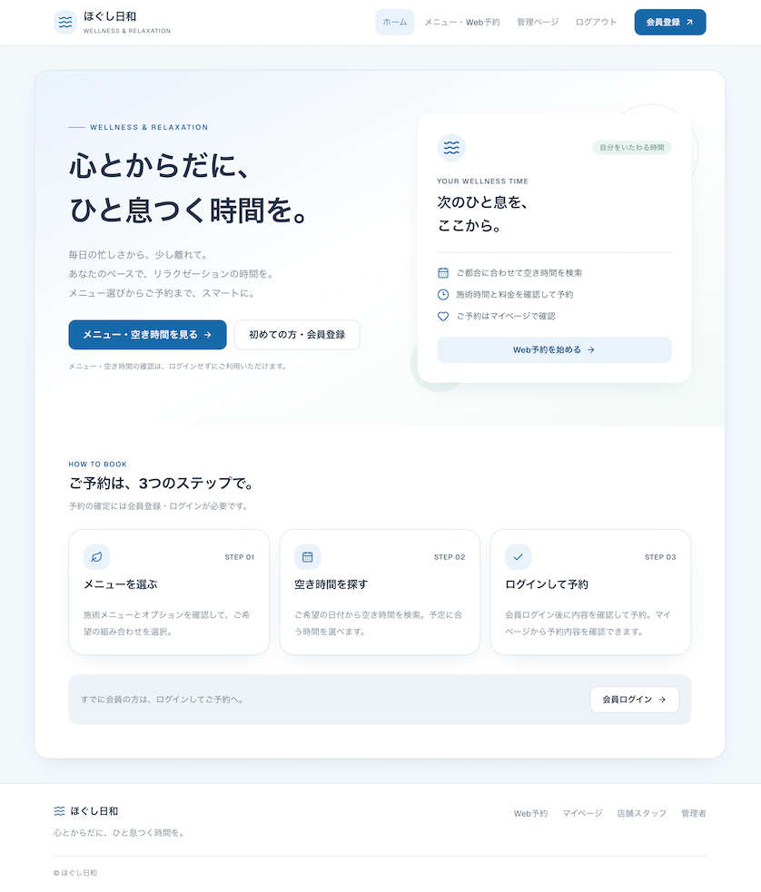

# マッサージサロン予約アプリ

Next.js・PostgreSQL・Prismaを使用する、マッサージ・リラクゼーションサロン向けの会員制Web予約アプリです。入会したお客様による予約受付と、店舗側の予約・施術メニュー・設備・施術者の管理を行います。



[サンプルページ(Vercel)](https://booking-sample.vercel.app/)


**要件・設計方針と開発手順をまとめたREADMEです。業務機能は実装予定です。開発環境の手順は第10章、作業の進捗は第15章を参照してください。**

## 1. 目的

- Web上で入会・ログインから予約・確認・キャンセルまで完結させる。
- 予約には会員登録を必須とし、非会員の予約を受け付けない。
- 部屋と施術者の空き状況を合わせて判定し、予約の重複を防ぐ。
- 部屋数・施術者数の変更に対応できるようにする。
- 決済や通知などを将来追加できる構成にする。

## 2. 技術構成

| 項目 | 採用技術・サービス |
| --- | --- |
| フレームワーク | Next.js（App Router） |
| 言語 | TypeScript |
| スタイリング | Tailwind CSS v4（theme.extend）＋shadcn/ui |
| データベース | PostgreSQL |
| ORM | Prisma |
| 認証 | NextAuth 5.0.0-beta.32（管理者・スタッフ認証実装済み） |
| メール配信 | Resend Email API＋DBの送信待ち管理＋保護された定期実行入口 |
| アプリのデプロイ先 | Vercel |
| データベースのホスティング | Neon |

利用者のブラウザからNext.jsのサーバー処理を経由し、PrismaでNeon上のPostgreSQLへアクセスする構成を想定します。既存パッケージのバージョン指定は`package.json`、解決済みバージョンは`package-lock.json`で管理します。NextAuth 5.0.0-beta.32を固定し、Credentials＋JWTと独自のDBセッション失効管理を採用しています。

### 現在の開発環境

| 項目 | 使用する版・設定 |
| --- | --- |
| Node.js | `.nvmrc`の22.23.1を開発・CIの基準とする。`engines`は22.23.1以上・23未満 |
| npm | 10.9.8で再現確認。依存は`npm ci`でlockfileから導入 |
| Next.js / React | 16.3.8 / 19.2.8 |
| TypeScript / Tailwind CSS | lockfileで5.9.3 / 4.3.3 |
| Prisma CLI・Client・pgアダプター | lockfileで7.10.0。CLI設定は`prisma7.config.ts` |
| ローカルDB | Docker Composeの`postgres:17-alpine`。ホスト側の`127.0.0.1:5432`へ公開 |
| 検証 | ESLint、TypeScript、Node.js標準テスト、DB疎通、本番ビルド、npm audit |
| CI | `.github/workflows/ci.yml`。検証・ビルドと依存監査を別jobで実行 |

Next.jsはホスト側で動かし、PostgreSQLだけをコンテナで動かします。DB・認証画面のローカル開発にVercel・Neon・Resendのアカウントは不要です。実際のメール送信にはResendの設定が必要です。会員・予約・認証主体・運用情報・適用日付き設定の計30モデルはローカルDBへ適用し、開発用初期データ・DB制約を検証済みです。管理者・スタッフ・会員認証、送信待ち登録、配送ワーカー、保護された定期実行入口を実装済みです。実Resend配信と本番定期実行は未検証です。予約画面と店舗管理画面は実装済みです。本番公開とブラウザ全フロー検証は未完了です。設定と手順は[Epic 3詳細設計](docs/detailed_design_ep3.md)を参照してください。

Prisma CLIの推移依存には、監査指摘に対応した版限定の`overrides`があります。更新時の扱いは[Epic 2詳細設計第7章](docs/detailed_design_ep2.md#7-dependency-auditの失敗への対応)を参照してください。

### 基本UIデザイン（2026-09-30実装）

- ブルーを基調とし、白いカード・淡いブルーの背景・控えめなグリーンで健康的でスマートな印象を作る。
- モバイルファースト。ヘッダーのグローバルメニューはスマートフォンでは開閉式、PC（lg以上）では横並び。全画面に共通ヘッダー・フッターを表示する。
- ヘッダーの「マイページ」（`/account`）は会員ログイン中だけ表示し、管理者・スタッフログイン中は「管理ページ」（`/manage`）を表示する。未ログイン時はどちらも表示しない。
- 会員・管理者・スタッフログイン中はヘッダーの「ログイン」を「ログアウト」ボタンに切り替える。成功後は会員を`/login`、管理者を`/admin/login`、スタッフを`/staff/login`へ戻す。
- `/login`はサーバーでセッションを確認し、ログイン中（会員・管理者・スタッフ）は「既にログイン中です。」を表示して入力フォームを非表示にする。認証確認に失敗した場合は再読み込みを案内する。
- `tailwind.config.ts`の`theme.extend`で既定テーマに色・角丸・影・フォントを追加。Tailwind v4の`@config`で読み込み、配色は`src/app/globals.css`のCSS変数で管理する。
- shadcn/uiのButton・Cardを`src/components/ui/`に配置。トップページ、予約・会員手続き・ログインの主要アクションに採用。追加コンポーネントの設定は`components.json`に管理する。
- キーボードフォーカス、本文スキップ、現在ページ表示、モバイルメニューのEscape閉じ、44px以上の主要操作領域に対応する。
- 画面ごとの既存の最大幅を維持し、フォーム画面は中央配置、PCでは余白を広く取る。既存の予約処理・認証・DBスキーマは変更しない。

設計と検証範囲は[基本UI詳細設計](docs/ui_design.md)を参照してください。

`/book`の日付選択は翌日〜30日先をカバーするカレンダーで表示します。メニュー・オプションに応じて空きなしの日をグレーで無効化し、空きのある日をクリックすると時刻選択モーダルを開きます。時刻選択で日時を反映し、メニュー変更時は再選択します。第3セクションは「3. 備考」、入力ラベルは「ご要望など（任意・1,000文字以内）」です。詳細は[Epic 5詳細設計第3章](docs/detailed_design_ep5.md#3-task-512公開空き検索)を参照してください。

## 3. 利用者

| 利用者 | 主な用途 |
| --- | --- |
| 非会員 | メニュー閲覧、空き時間検索、入会（会員登録） |
| お客様（会員） | ログイン、空き時間検索、予約登録、自分の予約内容確認・キャンセル |
| 店舗スタッフ | 初期状態は予約状況・履歴等の閲覧のみ。更新操作は管理者が個別付与 |
| 管理者 | 予約・各種マスタ管理、スタッフ作成、会員の強制退会・論理削除・復旧 |

入会・会員認証は初期リリースに含め、NextAuthを使用します。管理者のID（メールアドレス）・パスワードは開発環境の`.env`、本番ではホスティング先の環境変数で管理します。会員登録で管理権限を得ることはできません。

### スタッフ権限

管理者がスタッフを選択し、チェック項目で操作権限を付与・解除します。画面表示だけでなく、サーバー側でも各操作の権限を検証します。

| 操作 | スタッフの初期権限 | 付与方法 |
| --- | --- | --- |
| 予約状況・予約履歴等の閲覧 | 許可 | 初期状態で利用可能 |
| 予約の登録・変更・取消 | 不許可 | 管理者が操作ごとに付与 |
| メニュー・オプション・部屋・施術者の追加・編集・無効化 | 不許可 | 管理者が対象・操作ごとに付与 |
| 休憩、休日・営業時間の設定 | 不許可 | 管理者が個別付与 |
| スタッフ作成 | 不許可 | 管理者が個別付与 |
| 会員の強制退会・削除・復旧 | 不許可 | 管理者が個別付与 |
| 施術開始・完了、変更案内メール送信・対応状況更新 | 不許可 | 管理者が個別付与 |
| スタッフへの権限付与・解除 | 不許可 | 管理者専用。スタッフへ委譲不可 |

スタッフ作成権限があっても、作成したスタッフへの権限付与はできません。新規スタッフは必ず閲覧のみで開始し、自分自身の権限も変更できません。権限解除は既存セッションからの操作にも反映します。

## 4. 基本仕様

### 入会・会員限定予約

- 入会時の必須項目は、メールアドレス、氏名（姓・名）、電話番号、郵便番号、年代、パスワードとする。
- 電話番号は一般の連絡先として収集し、ハイフンなしの数字10〜11桁とする。郵便番号はハイフンを除いた数字7桁とする。先頭の0を保持するため、いずれも文字列として扱う。
- 年代の選択肢は20代・30代・40代・50代・60代・70代・80代とし、20歳未満・90歳以上は入会対象外とする。
- パスワードはUnicodeコードポイント数で15〜128文字とする。数字・記号等の組み合わせは強制しない。空白除去・正規化・切り捨てを行わない。
- メール確認完了と重複登録がないことを入会完了条件とする。再入会判定にはメールアドレスと氏名を用いる。退会済みレコードもメールアドレスの一意制約の対象とし、同一メールによる新規登録は氏名を変えても受け付けない。氏名だけ一致する場合の判定は第11章に記載する。
- `/register`で既存メールを入力した場合は「登録済み」を表示し、新しい確認メールは作成しない。確認が未完了なら確認メール再送、確認済みならログイン・パスワード再設定へ案内する。この応答から登録有無を推測できるため、メール・IP単位の試行制限を維持する。
- 退会済みの人の新規アカウントによる再入会は許可せず、復旧する場合は権限を持つ店舗利用者が既存アカウントに対して行う。メールアドレス・氏名の照合だけで、別情報を使う同一人物を完全に識別できるとは扱わない。
- メニュー閲覧・空き時間検索は非会員にも公開する。予約手続きへ進む時点で、非会員には入会、未ログインの既存会員にはログインを案内する。
- お客様自身の予約登録・確認・取消にはログインを必須とし、サーバー側で会員状態と予約の所有者を検証する。会員IDはセッションから取得し、予約へ必ず関連付ける。
- 店舗側の代理登録も予約可能な既存会員だけを対象とし、非会員の予約は作成できない。

### 確認メール・パスワード再設定

- 入会確認と復旧確認のトークンは24時間、パスワード再設定のトークンは1時間有効とし、一度だけ使用できる。
- 同じメールアドレスへの確認・再設定メールの利用者による再送は60秒間隔、1時間に5回までとする。送信元IPにも制限を設け、具体的な上限は実装設計で定める。
- 利用者が再送を要求した場合は同じ用途の古いトークンを無効化して新しいものを発行する。通信障害によるシステムの再試行では同じ送信要求・トークンを使う。
- 登録の有無によらず「対象のアドレスに案内を送信します」と表示する。
- パスワード忘れはトークンを含むリンクをメール送信し、再設定画面で新しいパスワードを受け付ける。トークン・パスワードはログへ出力しない。

### 退会・論理削除・復旧

- 削除フラグは退会を意味する。会員情報・予約履歴は物理削除せず、退会種別（任意／強制）、退会日時、任意退会理由、強制退会理由（任意入力）を保持する。
- 本人はマイページで理由の選択または自由記述を必須として退会できる。店舗による強制退会・削除は対応権限を持つ利用者だけが行える。
- 退会・削除では、通常の取消期限後であっても未開始の有効予約を自動取消し、占有枠を解放する。削除だけを行う場合も同じ処理とする。
- 施術中の予約は取り消さず、予約・占有枠を維持して店舗が完了処理する。早い完了操作で元の占有時間を短縮せず、少なくとも元の占有終了時刻まで枠を維持する。
- 完了・取消済み予約は履歴を保持する。退会と同時の予約作成で未開始の有効予約が残らないようにする。
- 退会時点で新規予約を禁止し、既存セッションを終了・制限する。施術中の予約は権限を持つ店舗利用者が引き続き管理する。
- 復旧操作では確認メールを自動送信し、確認完了後に既存会員を有効化する。取消済み予約は復活させない。

### 営業時間・予約枠

- 営業時間の初期値は **09:00〜18:00**。管理画面で休日・営業時間を変更できる。
- 初期設定の予約開始候補は **09:00、10:00、11:00、12:00、13:00、14:00、15:00、16:00、17:00** の9候補。
- 予約開始・占有枠は1時間単位とし、候補は対象日の営業時間から生成する。変更後も施術・占有枠の両方が閉店時刻までに終了する必要があり、閉店時刻開始は受け付けない。
- 施術時間は60分・90分・120分など分単位で扱う。休業日は予約を受け付けない。

### 予約受付・キャンセル期限

| 操作 | 期間・締切 |
| --- | --- |
| 通常の予約受付 | 予約日の30日前00:00から、予約日の前日の営業終了時刻まで。当日予約不可 |
| 通常のキャンセル | 予約日前日が営業日ならその日の営業終了時刻まで。休業日なら予約日前の直近営業日の営業終了時刻まで |
| 通常の店舗操作 | お客様と同じ期限を適用。管理者・スタッフも期限後の通常操作は不可 |
| 店舗都合の変更・取消 | 操作権限と理由記録を条件に期限後も可能。空き・休憩・会員状態等の検証は省略しない |
| 退会・削除による自動取消 | 通常期限後も未開始予約を取消。施術中は維持 |

- 締切は固定18:00ではなく、対象となる日の設定上の営業終了時刻に連動する。締切時刻ちょうどを含む（初期値なら18:00:00まで）。
- 休業日に伴う日付の繰り上げはキャンセルだけに適用する。予約受付は前日の暦日のままとし、休業日にも締切計算用の営業終了時刻を保持する。
- 30日前は暦月ではなく日付から30日を引き、Asia/Tokyoの00:00を受付開始とする。判定はサーバー側の現在時刻で検索時・保存時に行う。
- 営業時間変更による締切への影響も、設定変更時の影響確認対象に含める。

### 日時の保存・表示

- 予約開始・終了、登録・更新等の日時はPostgreSQLの`timestamp with time zone`（`timestamptz`）で保持し、UTCの時点として扱う。文字列形式でのDB保存には固定しない。
- 営業日は日付型、曜日別休憩は曜日と店舗の開始・終了時刻として保持する。
- 営業日・曜日・受付期限の計算と画面表示はAsia/Tokyoを基準とする。
- 表示は`Intl.DateTimeFormat`の`timeZone: "Asia/Tokyo"`、`hourCycle: "h23"`を用いる。`formatToParts()`で「2026年09月15日09:00」のようなゼロ埋めした24時間表示へ統一する。

### 部屋数・施術者数の変更

資料の「2室・2人」は初期設定例として扱い、固定の上限にはしません。

- 管理画面から部屋・施術者をそれぞれ追加・編集・無効化できる。
- 予約可能な部屋数・施術者数は、有効な登録データから算出する。
- 部屋数と施術者数は独立して変更できる。例：3室・2人、2室・4人。
- 部屋または施術者の有効件数が0の場合、新規予約は受け付けない。
- 施術者には各1時間の休憩を設定し、休憩中は割り当てない。
- 休憩は施術者ごと・曜日ごとに設定し、毎週繰り返す。曜日はAsia/Tokyoで判定し、管理画面で変更できる。

- 対象曜日の休憩が未設定の施術者は、その日の新規予約の割り当て対象にせず設定を促す。

**設計方針：** 部屋・施術者は個別レコードで管理し、履歴から参照されるレコードは物理削除せず無効化します。

### 営業日・営業時間・休憩設定の適用日

- 営業日・営業時間・施術者の曜日別休憩を変更する際は、変更内容と適用日を保存する。適用日の **Asia/Tokyo 00:00** から新しい設定を有効とし、それより前の対象日には従来の設定を使う。
- 通常の事前変更は、適用日が設定日から **30日より後（31日後以降）** であることを条件とする。日数はAsia/Tokyoの暦日差で判定し、登録時刻からの経過時間では計算しない。
- **30日後ちょうどを含む、それより近い適用日**は直近変更として例外的に受け付ける。既存予約への影響を確認し、影響があれば下記のメール案内・店舗調整を行う。影響がなければ案内メールは不要とする。
- 例：9月16日に設定する場合、通常の事前変更は10月17日以降を適用日とする。10月16日（30日後）までの適用は直近変更として扱う。
- 将来日の空き検索・予約保存では、現在有効な設定ではなく、**予約対象日に有効になる設定**を参照する。適用日前でも、適用日以降の予約は保存済みの新設定で判定する。締切計算にも、締切の基準日で有効な営業設定を使う。
- 設定は適用日付きの履歴として保持し、変更保存だけで従来設定を上書きしない。適用日の0:00を過ぎたかどうかは日時で判定し、定期処理の遅延によって旧設定が使われないようにする。
- 予約受付が30日前からのため、31日後以降の変更は通常、受付開始前に設定できる。ただし店舗都合の例外予約等も考慮し、事前変更でも既存予約への影響は確認する。影響があれば同じ調整手順で対応する。
- 保存済みの将来設定を再変更する際も、その変更を保存する日から適用日までの日数と予約への影響を再判定する。部屋・施術者の無効化は今回の適用日ルールの対象に追加せず、既存の影響確認・調整運用を継続する。

### 店舗都合の設定変更・予約調整

1. 設定保存時に、適用日以降の営業日・営業時間・休憩変更、または部屋・施術者の無効化によって施術不能になる予約を検出する。適用日を待たずに影響を確認する。
2. 新規受付は予約対象日に有効な設定で判定する。影響予約は「要調整」としてダッシュボードへ表示し、予約履歴と占有枠を維持する。休業日・無効な設備等を空き候補に出さない。適用日前の予約に将来設定を誤適用しない。
3. 権限を持つスタッフが対象・内容を確認し、送信操作を行う。影響検出だけで案内メールを自動送信しない。
4. 変更後の設定に基づき、元の開始時刻の前後2時間以内・同日内で必要枠全体が空く候補を案内する。候補がない場合は別日時の調整または取消について店舗への連絡を案内する。
5. 候補があってもメール送信・閲覧だけでは予約や仮押さえは成立しない。顧客からの依頼を受け、店舗側が再検証して変更・取消を確定する。変更失敗時は元の予約・要調整状態を保持する。

回答期限・自動取消は設けません。来店日時が迫る未対応案件を目立たせ、店舗が対応します。送信状態と対応状態を別々に管理します。設定変更・影響予約の記録と予約登録が競合しても、不整合や対象漏れが起きないようにします。

### 同時予約可能数

同一の対象時間帯について、基本的な上限は次のとおりです。

```text
同時予約可能数 = min(空いている部屋数, 休憩中ではない空き施術者数)
```

| 状況 | 同時予約可能数 |
| --- | ---: |
| 空き部屋2室・空き施術者2人 | 2件 |
| 空き部屋3室・空き施術者2人 | 2件 |
| 空き部屋2室・空き施術者4人 | 2件 |
| 空き部屋2室・施術者2人のうち1人が休憩中（他方は空き） | 1件 |

複数枠を使用する予約では、必要な全枠にわたり同じ部屋・同じ施術者が空いていることを確認します。

## 5. 施術メニュー・オプション

管理者が名称・時間・料金を追加・編集できます。料金は税込表示とし、以下の登録例・合計料金も税込で扱います。

### 施術メニュー

| メニュー | 施術時間 | 料金 |
| --- | ---: | ---: |
| ボディケア | 60分 | 6,000円 |
| オイルマッサージ | 90分 | 9,000円 |
| 全身コース | 120分 | 12,000円 |

### オプション

| オプション | 追加時間 | 追加料金 |
| --- | ---: | ---: |
| ヘッドマッサージ | 10分 | 1,000円 |
| 足つぼ | 20分 | 2,000円 |
| ホットストーン | 0分 | 500円 |

- 予約ごとに施術メニューを1つ選択する。
- オプションは任意で複数選択できる。
- 追加時間が0分のオプションにも対応する。
- 料金・時間の例は固定仕様ではなく、管理画面で変更できる。

## 6. 予約情報

### 会員情報から取得する情報

- 氏名（姓・名）
- メールアドレス
- 電話番号

郵便番号・年齢（年代）は入会時の必須会員情報として保持し、予約へは複写しません。予約履歴で必要な氏名・メールアドレス・電話番号を複写します（Epic 2詳細設計第10章）。

会員IDはログイン中のセッションからサーバー側で取得します。店舗側の代理登録では、操作権限と指定会員の状態を検証します。予約時点の氏名・連絡先を予約に保存し、後日の会員情報変更で過去の予約情報が変わらないようにします。

### お客様が入力・選択する情報

- 予約日・開始時刻
- 施術メニュー
- オプション（任意・複数選択可）
- 備考

### システムが計算・割り当てする情報

- 合計施術時間
- 合計料金
- 必要予約枠数
- 施術終了時刻
- 予約枠の占有終了時刻
- 使用する部屋
- 担当施術者

お客様による部屋・施術者の指定は初期リリースの対象外です。

## 7. 予約ロジック

### 時間・料金の計算

```text
合計施術時間 = メニューの施術時間 + 選択したオプションの追加時間合計
合計料金 = メニュー料金 + 選択したオプションの料金合計
必要予約枠数 = ceil(合計施術時間 / 60分)
施術終了時刻 = 開始時刻 + 合計施術時間
占有終了時刻 = 開始時刻 + 必要予約枠数 × 60分
```

| 合計施術時間 | 必要予約枠数 | 10:00開始時の施術終了 | 占有終了 |
| --- | ---: | --- | --- |
| 60分 | 1枠 | 11:00 | 11:00 |
| 70分 | 2枠 | 11:10 | 12:00 |
| 90分 | 2枠 | 11:30 | 12:00 |
| 120分 | 2枠 | 12:00 | 12:00 |
| 130分 | 3枠 | 12:10 | 13:00 |

端数切り上げ後の占有時間中は、同じ部屋・施術者を他の予約に割り当てません。休憩との重複も占有時間全体で判定します。

### 予約可能条件

予約対象者が予約可能な会員であることを前提に、次の条件をすべて満たす場合のみ予約できます。お客様自身の操作ではログインを、店舗側の代理登録では操作権限をサーバー側で検証します。

1. 対象日が営業日であり、開始時刻が予約開始候補に含まれる。
2. 必要な枠がすべて営業時間内に収まる。
3. 同じ有効な部屋が、必要な全枠で空いている。
4. 同じ有効な施術者が、必要な全枠で空いている。
5. 対象施術者の曜日別休憩と占有時間が重ならない。
6. 予約受付期間内であり、前日の営業終了時刻を基準とする締切を過ぎていない。

たとえば10:00〜12:00の予約では、10時台に施術者A、11時台に施術者Bが空いているだけでは成立しません。同じ施術者が両方の枠で空いている必要があります。

### 自動割り当ての優先順位

空き・有効状態・休憩・営業時間の条件を満たす候補に対し、次の順で割り当てます。

1. 占有終了と次の予約開始が接する場合を「連続」とし、前後に接する予約が少ない施術者を優先する。
2. 同順位なら、当日の合計占有時間が少ない施術者を優先する。
3. なお同順位なら、表示順・IDなどの固定順で決定する。
4. 部屋も空いている候補を管理用の表示順・IDの固定順で決定する。

連続回避は候補間の優先順位であり、空き条件を満たす施術者が連続施術になる人だけの場合も予約可能です。対象曜日の休憩が未設定なら候補から除外します。

### 登録・変更・取消

1. 会員状態・ログイン状態・操作権限を検証したうえで、メニュー・オプションを検証し、サーバー側で時間と料金を計算する。
2. 対象日・必要枠全体の空きを確認する。
3. 条件を満たす部屋と施術者を自動割り当てする。
4. 保存時に競合を確認し、予約と枠の確保をまとめて確定する。
5. 予約内容をお客様に表示する。

- 変更時も同じ条件で再判定し、成功した場合に枠の移動を確定する。店舗都合の期限後例外は理由と操作者を記録する。失敗時は元の予約を維持する。
- 通常の取消は第4章の直近営業日・営業終了時刻に基づく期限を検証し、予約履歴を残して枠を解放する。店舗都合の理由付き操作と退会時の未開始予約の自動取消は期限後も可能とする。
- 退会と予約登録が同時に行われても未開始の有効な予約が残らないよう、会員状態更新・対象予約の取消・枠解放を一貫して確定する。
- 空き検索後に別の予約が成立した場合は、保存を拒否して再選択を案内する。

### 重複防止の設計方針

元資料の配列を用いたコードは考え方の例です。実装では開始時刻の一致だけで判定せず、**予約日と既存予約の占有時間全体**を確認します。

Task 2.2.3で、予約が使用する1時間枠ごとのReservationSlotと、「部屋ID＋枠の開始日時」「施術者ID＋枠の開始日時」それぞれの一意制約をSchemaへ定義しました。予約本体との複合外部キーで割当先の一致も定義しています。Task 2.2.4でローカルDBへの適用と、隔離スキーマ上の重複拒否・同時競合を検証しました。予約と全占有枠を同一トランザクションで作成し、一部の枠が競合した場合は全体を取り消します。取消時は占有レコードを解放し、予約本体の履歴を保持します。

休憩・営業日・有効状態の更新と予約登録の競合も考慮し、整合性を保つ排他制御・再検証方式は詳細設計で決定します。

## 8. 画面・機能

### お客様画面

- 入会（会員登録）
- メール確認、ログイン・ログアウト、メールリンクによるパスワード再設定
- メニュー・オプション選択（非会員にも公開）
- 空き時間検索（非会員にも公開）
- 会員情報・予約内容確認、予約登録（ログイン必須）
- マイページで自分の予約一覧・詳細確認（ログイン必須）
- 自分の予約キャンセル（ログイン必須）
- マイページからの理由入力を伴う退会
- 店舗都合の変更案内メールから店舗へ連絡する導線（予約変更の確定は店舗が行う）

### 管理画面

- スタッフアカウント作成、管理者専用のスタッフ別権限設定
- 会員の強制退会・論理削除・復旧
- 営業日・営業時間・休憩変更、部屋・施術者無効化の影響確認と要調整一覧
- スタッフ確認後の案内メール送信、送信状況・対応状況確認
- 施術開始・完了の操作、店舗都合の期限後変更・取消と理由記録
- 予約一覧・カレンダー表示
- 会員を対象とする予約登録・変更・取消
- 施術メニュー管理
- オプション管理
- 施術ルーム管理（追加・編集・無効化）
- 施術者管理（追加・編集・無効化）
- 施術者ごと・曜日ごとの繰り返し休憩設定
- 営業日・営業時間設定
- 営業日・営業時間・休憩の適用日指定、適用予定の一覧、直近変更の影響確認

## 9. データモデル案

以下は全体のモデル案です。Task 2.2.1で会員・予約・マスタ・認証主体の基本モデルを、Task 2.2.2で予約時点のスナップショットを、Task 2.2.3で占有枠・一意制約・検索用インデックスを`prisma/schema.prisma`へ定義しました。Task 2.2.4で初回migrationと開発用seedを作成し、ローカルDBへ適用・検証しました。Task 2.2.5で権限・トークン・退会／審査・施術実績・要調整・配信・監査・試行制限と曜日設定の保存先を追加しました。営業・休憩の適用日・版・日別上書きはTask 2.2.6で追加します。実装範囲・型・残る制約は[Epic 2詳細設計第9〜13章](docs/detailed_design_ep2.md#9-task-221基本モデル認証主体型の定義)を参照してください。

| モデル | 主な役割 |
| --- | --- |
| Member | 基本情報、会員状態・削除フラグ・認証版・更新版・復旧世代。退会・復旧の履歴はMemberLifecycleEventへ分離 |
| StaffAccount | スタッフ専用の認証情報・有効状態・認証版 |
| AdminAccount | 管理者の固定監査用ID・有効状態。資格情報・認証版は環境変数 |
| AppSession | JWTと照合するアプリ独自の主体・認証版・絶対期限・失効記録 |
| StaffPermission | スタッフ別の操作権限・付与管理者・日時。解除後の履歴はAuditLogへ記録 |
| AuthToken | SHA-256ダイジェスト、用途、会員／スタッフ、メール照合キー・認証版・復旧世代、期限・使用・失効日時 |
| MemberLifecycleEvent | 任意／強制退会・復旧開始／完了／中止、理由、復旧世代、操作記録 |
| MemberReview / MemberReviewMatch | 氏名一致の審査・候補会員、管理者の判断・根拠 |
| Room | 部屋の名称・有効状態 |
| Therapist | 施術者の名称・有効状態 |
| TherapistSchedule / TherapistBreak | 施術者ごとの設定内容と曜日別1時間休憩／未設定。適用日・版は2.2.6 |
| BusinessSchedule / BusinessDay | 曜日別の営業／休業・開閉店時刻。休業日も締切用閉店時刻を保持。適用日・版は2.2.6 |
| ScheduleSettingChange | 営業日・営業時間・休憩の変更内容、適用日、登録日時・操作者、変更前後の設定履歴（設計案） |
| Treatment | メニュー名・施術時間・料金・有効状態 |
| Option | オプション名・追加時間・料金・有効状態 |
| Reservation | 必須の会員ID、予約時点の氏名・連絡先、日時、割当先、合計時間・料金、予約状態、施術開始・完了日時、取消理由・操作者、備考 |
| ReservationOption | 予約と選択オプションの関連、予約時点の名称・時間・料金 |
| ReservationSlot | 1時間ごとの占有枠、部屋／施術者別の枠一意制約、予約本体と割当先を一致させる複合外部キー |
| ReservationChangeNotice | 変更元の監査ID＋予約の一意な影響記録、理由・変更候補・対応状態・版 |
| EmailDelivery / EmailDeliveryAttempt | 消さない送信要求キー、対象・送信確認、状態・再試行・処理権、消去可能な暗号化ペイロード・試行詳細 |
| AuditLog | 操作者の必須整合・対象・操作・要求キー・許可項目の変更記録。UPDATE／DELETEを拒否 |
| RateLimitBucket / RateLimitEvent | 用途別HMACキーと試行時点。原子的な制限判定は後続サービスで実装 |

予約時点の氏名・連絡先、メニュー・オプションの名称・時間・料金、部屋・施術者の名称を保存する必須項目を定義しました。後日の会員情報・マスタ編集では複写項目を更新せず、履歴表示はこの値を使います。参照関係は削除・ID更新をRestrictとし、退会・無効化後も維持します。実際の複写・表示処理は後続Epicで実装します。

会員と予約は1対多で関連付け、予約の会員IDを必須に定義しました。認証はCredentials＋JWTと独自のAppSessionを前提とし、NextAuthの導入・動作確認はStory 3.1／3.3で行います。会員・スタッフのDB上のパスワードはハッシュとして保存し、確認・再設定トークンは有効期限付き・一度限りの利用とする設計です。退会後も会員情報と予約履歴を保持し、論理削除から復旧できる関連を維持します。復旧は24時間有効の確認メールからの確認完了後に行い、取消済み予約は復活させません。退会済みを含むメール照合キーの一意制約と氏名の照合用項目を定義し、氏名だけには一意制約を置きません。会員状態の整合性・セッション主体の排他・予約日時計算等のCHECK制約は初回migrationへ組み込み、DBで検証しました。状態遷移・認可・複数行の整合性は後続サービスで実装します。

## 10. 開発・デプロイ方針

### 初回セットアップ

リポジトリを取得し、`package.json`のあるルートディレクトリで実行します。以下はmacOS・Linux・WSLのシェル向けです。Node.jsとnpm、起動済みのDocker Engine（Docker Desktop等）、Composeの`--wait`に対応する`docker compose`が必要です。npmパッケージ・コンテナイメージ・Google Fontsを取得できるネットワークを用意します。

1. `.nvmrc`のNode.jsを選択します。nvmを利用している場合は`nvm install` → `nvm use`。別のバージョン管理ツールを使う場合も22.23.1を指定します。
2. 実行環境を確認します。

```bash
node --version
npm --version
docker compose version
```

3. 初回だけ環境変数ファイルを用意し、依存をインストールします。次のコピーは既存`.env`を上書きしません。

```bash
if [ ! -e .env ]; then cp .env.example .env; fi
npm ci
```

既存`.env`がある場合は、下表の2変数を`.env.example`のローカル接続先と照合してください。例の資格情報はローカルCompose専用です。本番に流用せず、実際の`.env`はコミットしません。

| 変数 | 参照元 | ローカル設定 |
| --- | --- | --- |
| `DATABASE_URL` | アプリの`getPrisma()`・`db:check` | `.env.example`のPostgreSQL接続URL |
| `DIRECT_URL` | Prisma CLIの`prisma7.config.ts` | ローカルでは`DATABASE_URL`と同じURL |

アプリと`db:check`はNext.jsの環境変数読込規則を使い、シェルに設定済みの変数や`.env.local`等が`.env`より優先されます。Prisma CLIはdotenvで`.env`を読み、設定済みのシェル変数を優先しますが、`.env.local`は自動で読みません。接続先が異ならないよう両変数を管理し、`NEXT_PUBLIC_`は付けません。

4. DBを起動し、静的チェック・Client生成・テスト後、migration・初期データを適用してDB疎通を確認します。各コマンドが成功してから次へ進みます。

```bash
npm run db:up
npm run check
npm run db:migrate
npm run db:seed
npm run db:check
npm run test:db
```

`db:up`はDBのhealthyを待ちます。`check`はschema検証 → Client生成 → lint → 型生成・型チェック → テストの順で実行します。`db:check`の成功表示は`Local PostgreSQL: SELECT 1 succeeded (shared Prisma Client).`です。`db:migrate`は未適用migrationだけを適用し、`db:seed`は管理者ID・部屋2室・施術者2名・メニュー3件・オプション3件を作成します。再実行で既存行の編集・無効化を上書きしません。`test:db`は独立した一時スキーマで再作成とDB制約を検証し、そのスキーマだけを削除します。通常のpublicスキーマはリセットしません。営業・休憩は適用日付き履歴として保存します。開発用seedは2026-09-01から月〜土曜09:00〜18:00・日曜休業、施術者1は12:00〜13:00・施術者2は13:00〜14:00の休憩（日曜は未設定）を投入します。休業日も締切計算用の閉店時刻18:00を保持します。既存の設定予定・訂正・取消をseedで上書きしません。詳細はEpic 2詳細設計第14章を参照してください。

`db:migrate`・`db:seed`・`test:db`はNext.jsと同じ環境読込を行い、両URLが同一のローカルpublicスキーマであることを要求します。外部DB・URL不一致を接続前に拒否します。詳細は[Epic 2詳細設計第12章](docs/detailed_design_ep2.md#12-task-224初回migration開発用seeddb適用と再作成検証)を参照してください。

### 開発時の起動・停止

セットアップ済みなら次の順で起動します。依存やlockfileが変わった場合は先に`npm ci`、Prismaスキーマが変わった場合は`npm run db:generate`を実行します。

```bash
npm run db:up
npm run dev
```

ターミナルに表示されたURL（通常は[http://localhost:3000](http://localhost:3000)）をブラウザで開きます。現在はNext.jsの初期画面で、`To get started, edit the page.tsx file.`が表示されれば起動確認になります。この画面はDBを使わないため、DBへの接続は`npm run db:check`で別に確認します。

アプリは実行中のターミナルで`Ctrl+C`を押して停止します。DBも止める場合は、同じプロジェクトのルートで次を実行します。

```bash
npm run db:down
```

名前付きボリュームにDBデータが残り、次回の`db:up`で再利用されます。通常の停止手順にボリューム削除（`down -v`）やDBリセットは含めません。

### 検証と本番モードのローカル起動

開発サーバーを停止してから、次を順に実行します。

```bash
npm run check
npm run db:check
npm run build
npm run audit:dependencies
npm run start
```

`start`は成功した`build`の成果物を使います。ブラウザで同じ初期画面を確認し、`Ctrl+C`で停止します。これはローカルの本番モード確認で、Vercelへのデプロイではありません。

| コマンド | 確認内容・前提 |
| --- | --- |
| `npm run check` | まとめて静的検証とテスト。DB稼働は不要だが、CLI設定読込のため`DIRECT_URL`は必要 |
| `npm run db:validate` / `npm run db:generate` | schema検証／Client生成。設定ファイルはスクリプト内で明示 |
| `npm run lint` | ESLint。`build`とは別に実行する |
| `npm run typecheck` | `next typegen`後にTypeScript検証 |
| `npm test` / `npm run test:watch` | 単発／継続テスト。現在は接続先ガード等の23件でDB不要 |
| `npm run db:migrate` | ローカルDBへのmigration適用・適用状況確認。resetなし |
| `npm run db:seed` | 固定IDで初期データ作成。既存の値は保持 |
| `npm run db:seed:remote -- --file .env.sample --expected-host HOST --expected-database DATABASE` | サンプル用Neonへ同じ初期データを投入。指定ファイルと接続先を検証し、既存の値は保持。詳細は[公開手順](docs/operations.md#0-今回のサンプル公開単一環境) |
| `npm run test:db` | 稼働中のローカルDBで再作成・制約・競合を検証。スキーマ作成権限が必要 |
| `npm run db:check` | 稼働中のローカルDBへ`SELECT 1`。テーブル・業務機能の検証ではない |
| `npm run build` | 本番ビルド。現在はGoogle Fonts取得にもネットワークが必要 |
| `npm run audit:dependencies` | 全依存を監査し、high以上で失敗する。下記の期限付き例外のみ許容。レジストリへの通信が必要 |

GitHub Actionsはpush・pull request・手動実行で起動します。`checks`は専用PostgreSQLを使って`npm ci` → `check` → `db:migrate` → `db:seed` → `test:db` → `test:e2e:http` → `db:check` → `build`、`dependency-audit`は依存監査を実行します。ローカルの成功とGitHub上の成功は別に確認します。今回のDB検証追加後のGitHub実行は未確認です。

### 2026-10-05：未修正のbraces脆弱性と期限付き例外

`braces@3.0.3`には、深くネストしたパターンによってスタックを枯渇させ、Node.jsプロセスを停止させるhighの脆弱性があります（[GHSA-vfj7-8cjw-p6xm](https://github.com/advisories/GHSA-vfj7-8cjw-p6xm)）。2026-10-05時点では公式アドバイザリに修正版がなく、npmの最新版も3.0.3です。

このリポジトリでは`eslint-config-next → @next/eslint-plugin-next → fast-glob → micromatch → braces`と、`vercel → @vercel/backends → ts-morph → @ts-morph/common → fast-glob`経由で含まれます。監査のhigh 23件は、この1件が依存先へ波及した結果です。現在のlockfileでは開発依存に限定され、`npm ls braces --omit=dev`では本番依存に含まれません。ただし、開発・ビルド・公開ツールの処理が停止するリスクは残ります。**脆弱性を修正した対応ではありません。**

利用者の承認により、`scripts/audit-dependencies.mjs`で全依存の`npm audit --json --audit-level=high`を実行し、次の条件だけを一時的に許容します。CIの監査jobも同じコマンドを使います。監査のJSON全文と例外の警告はログに残します。

- 期限は**2026-10-19 23:59:59.999（日本時間）まで**。10月20日0時以降、対象の脆弱性が残っていればCIを失敗させます。環境変数やCLIから期限を延長する機能はありません。
- 対象は`braces@3.0.3`の上記アドバイザリと、それだけを原因とする依存先への波及です。各対象がlockfileで開発依存であることを必須とします。
- 別のhigh以上の脆弱性、同じパッケージへの別の指摘、criticalへの昇格、本番依存への移動は失敗させます。レジストリ通信エラー・不正なJSON・監査形式の変更も失敗させます。

修正版が公開されたら互換性を確認して依存・lockfileを更新し、例外判定を削除して通常の`npm audit --audit-level=high`へ戻します。期限到来時に修正版がなければ対応方針を再検討し、期限を自動延長しません。`npm audit fix --force`によるESLint設定やVercel CLIの旧版への変更は行いません。

### うまく動かない場合

| 症状 | 確認・対処 |
| --- | --- |
| Node版の不一致・`EBADENGINE` | `.nvmrc`の版を選択し直し、`npm ci`を再実行 |
| Dockerへ接続できない | Docker Engineの起動・ソケットへのアクセス権を確認 |
| DBがhealthyにならない・5432番が使用中 | `docker compose ps`で状態を確認。既存PostgreSQLや別コピーのComposeとのポート競合を解消する |
| `DIRECT_URL`未設定 | ルートの`.env`に変数があるか確認。CLIは`.env.local`だけでは読み込めない |
| `DB check failed` | DBの稼働と環境変数の上書きを確認。許可先はローカルhost、5432番、`booking_sample`、任意の`schema=public`のみ。外部DBは接続前に拒否される |
| 3000番が使用中 | 既存プロセスの用途を確認。開発時は表示URLを使うか`npm run dev -- --port 3001`。本番モードは`npm run start -- --port 3001` |
| Google Fontsの取得失敗 | ネットワーク・プロキシ設定を確認し再実行。通信制限下の失敗とコードのエラーを区別する |
| 本番ビルドがないというエラー | `dev`を止め、`npm run build`の成功後に`npm run start` |
| 依存監査が失敗 | 指摘対象と修正版の互換性を確認。`npm audit fix --force`で一括major変更せず、[Epic 2詳細設計第7章](docs/detailed_design_ep2.md#7-dependency-auditの失敗への対応)のoverride管理方針に従う |

### デプロイ方針・後続作業

今回はVercel 1プロジェクト・サンプル用Neon DB 1つで動くサンプルを公開します。検証／本番の環境分離やGitHub Environmentsは不要です。`.github/workflows/ci-deploy.yml` が既存 `ci.yml` の全検査を再利用し、成功した `main` のpushだけをVercelへ公開します。CLIはlockfileで固定し、公開前にDBのmigration適用状況、公開後に固定URLへのsmokeを確認します。migrationは手動準備で、自動適用・seed・resetは行いません。VercelのGit自動デプロイは停止済みです。必要なrepository secrets・Vercel環境変数・初回DB準備は[サンプル公開手順](docs/operations.md#0-今回のサンプル公開単一環境)を参照してください。CronはHobby対応の日次で、操作直後のメール送信は維持します。GitHub/Vercel上の実行・接続・公開確認は未実施です。環境分離などの実運用要件は[Epic 7詳細設計](docs/detailed_design_ep7.md#6-story-72環境分離デプロイ運用task-721724)に残します。

初期リリースには入会・復旧確認、パスワード再設定、会員の予約確定（会員本人・管理者宛て）、店舗都合の変更案内メールの配信基盤を含めます。管理者認証情報・認証用秘密鍵は`.env.example`の項目をローカル環境へ設定します（[Epic 3のハンズオン](docs/detailed_design_ep3.md#6-ハンズオン手順)）。実値はリポジトリ・ブラウザ・ログへ出力しません。実際の配信には`RESEND_API_KEY`と、送信に使えるドメインの`RESEND_FROM`を設定します。

設計の根拠と手順の実行結果は[Epic 2詳細設計](docs/detailed_design_ep2.md)の第3・6〜8章で管理します。

## 11. 実装前の決定事項と残る設計詳細

### 確定した方針

追記された案と確認回答を以下の仕様に統合しました。第3〜10章およびロードマップにも反映しています。実装・動作確認の完了を示すものではありません。

| 項目 | 決定内容 |
| --- | --- |
| 認証 | NextAuthを使用。管理者の認証情報は開発時`.env`・本番環境変数で管理する。 |
| スタッフ権限 | 初期状態は閲覧のみ。予約・マスタの更新、スタッフ作成、休憩・休日・営業時間設定、強制退会・削除・復旧等は個別付与。権限付与・解除は管理者専用。 |
| 入会・再入会 | メール確認必須。メールアドレスと氏名を再入会判定に使用し、退会後の新規アカウントによる再入会は不可。同一メールは退会済みを含め重複不可。 |
| 必須情報 | メールアドレス・姓・名・電話番号・郵便番号・年代・パスワード。電話番号は数字10〜11桁、郵便番号はハイフン除去後の数字7桁。年代は20代〜80代で、20歳未満・90歳以上は対象外。 |
| パスワード | 15文字以上・少なくとも64文字まで許容。数字・記号の組み合わせは強制しない。 |
| トークン | 再設定は1時間、入会確認・復旧確認は24時間有効。一度限り利用可能。利用者による再送では旧トークンを失効させる。 |
| 再送制限 | 同じメールアドレスへ60秒間隔・1時間5回まで。IPにも制限を設ける。通信障害の再試行では同じ要求・トークンを使用する。 |
| 退会・削除 | 削除フラグ＝退会。任意／強制の種別を保持。任意退会は理由必須、強制退会理由は任意。未開始予約は期限後も自動取消・枠解放し、情報・履歴は保持する。 |
| 施術中・復旧 | 施術中予約は維持し、少なくとも元の占有終了まで枠を保持。復旧確認メールを自動送信し、確認完了後に既存会員を有効化する。取消済み予約は復活させない。 |
| 公開範囲 | 非会員もメニュー閲覧・空き検索可能。予約開始時に入会・ログインを案内する。 |
| 受付期限 | 予約日の30日前00:00から前日の営業終了時刻まで。前日が休業日でも日付を繰り上げない。締切時刻ちょうどを含む。 |
| 取消期限 | 予約日前の直近営業日の営業終了時刻まで。休業日による繰り上げはキャンセルだけに適用する。締切は営業時間変更に連動する。 |
| 期限の例外 | 通常操作は管理者・スタッフも期限厳守。店舗都合は権限・理由記録付きで変更・取消可能。退会・削除の自動取消も例外とする。 |
| 設定の適用日 | 営業日・営業時間・休憩は適用日を指定し、Asia/Tokyoの00:00から有効。通常は設定日から31日後以降。30日後までの直近変更は影響確認付きの例外とする。将来予約も対象日に有効な設定で判定する。 |
| 設定変更の影響対応 | 保存時に適用日以降の影響予約を検出し、要調整として枠・履歴を維持。影響がある場合だけスタッフ確認後のメール案内・店舗調整を行う。部屋・施術者無効化も影響対応は共通とする。 |
| 案内・変更確定 | スタッフが確認して送信。同日内・元の開始時刻の前後2時間以内の候補を案内し、候補の有無によらず顧客から店舗へ連絡してもらい、店舗側が変更を確定する。回答期限・未回答による自動取消は設けない。 |
| 割り当て | 占有時間が前後の予約と接する数が少ない施術者を優先し、同順位なら当日の合計占有時間が少ない人、さらに同順位なら固定順。部屋も固定順。 |
| 休憩 | 施術者・曜日ごとに1時間を設定し毎週繰り返す。対象曜日が未設定の施術者は割り当て対象外。 |
| 日時・料金 | 予約等の日時は`timestamptz`、営業日は日付、休憩は曜日＋店舗時刻。Asia/Tokyoで計算・24時間表示し、表示に`Intl.DateTimeFormat`を使用。料金は税込。 |

### メール配信・運用の確定仕様

- ResendのEmail APIを使い、DBの送信待ちレコードをバックグラウンド処理が送信する。入会・確認メール再送・再設定の要求はDB確定直後に対象メールの配送を開始し、Cronは未処理分と再試行分を回収する。送信要求キーをResendの冪等キーにも指定する。店舗都合の案内はスタッフの送信確認後にキューへ登録する。
- 一時的な障害は初回失敗から1分後、さらに5分後、さらに30分後に最大3回再試行する（初回を含め最大4回、初回から約36分まで）。トークン期限が先に来る場合はそこで停止する。認証エラー・恒久的な宛先エラー・結果不明は自動再試行しない。
- 「設定変更ID＋予約ID＋通知種別」等の送信要求キーを一意にし、連打・複数処理による二重登録を防ぐ。送信待ちの取得も競合制御し、同じ要求を複数処理が同時送信しない。
- 会員本人の新規予約が確定すると、会員の予約時メールアドレスと `ADMIN_EMAIL` に予約日時・施術・オプション・料金・詳細ページへのリンクを自動送信する。予約と2通の送信要求は同時に保存し、予約要求の再送で通知を増やさない。変更・取消・退会後の古い確定通知は送信直前に停止する。店舗の代理予約と変更・取消の通知は対象外。
- Resendへの送信要求中の通信断などは結果不明として記録する。Resendの冪等キーの保持は24時間のため、DB側でも要求の一意性を維持する。配信の重複ゼロは保証せず、重複メールから予約変更等が二重実行されないようにする。期限切れ・失効済みトークンのメールは再試行対象にしない。
- 配信状態（送信待ち／送信中／送信受付済み／送信失敗／結果不明）と顧客対応状態（未対応／連絡中／変更済み／取消済み）を分離する。送信受付済みを到達・既読・顧客確認済みとは扱わない。
- 回答期限を設けず、来店日時が迫る未対応案件をダッシュボードで目立たせる。店舗が電話・メール等で調整し、対応結果を記録する。
- 操作記録には操作者・対象ID・操作内容・日時・結果・例外理由を残す。技術ログにはパスワード・トークン・メール本文を出力しない。
- 技術ログの保存期間は初期値90日とする。会員情報・予約履歴・業務操作記録は退会後も自動削除期限を設けず保持する。詳細は本章の保存方針を参照する。

### 設定管理の詳細（2026-09-17採用）

- 営業時間は曜日別の基本設定に日別上書きを優先する。開閉店・休憩開始は正時のみ、同日内とし、閉店は最大23:00とする。
- 休業日も締切用の閉店時刻を保持する。変更前の有効な閉店時刻を初期表示し、明示保存する。
- 通常の設定変更は翌日以降を適用日とし、過去・当日は拒否する。初期設定は運用開始日から有効とする。当日の緊急対応は資源無効化・理由付き店舗都合の予約変更／取消で行う。
- 同一適用日の訂正は版を指定し、旧版を履歴に残す。古い版による上書きは拒否する。
- 適用日前の予定のみ取消可能とし、直前の有効設定（日別上書き取消なら曜日別設定）へ戻す。後続の予定は維持し、取消時も影響確認を行う。
- 影響解消時は店舗確認待ちとし、履歴・予約・枠を保持する。古い未送信案内は送信対象外とし、送信中・送信済みの場合は店舗へ追加連絡の必要性を表示する。
- 締切変更だけで施術可能な予約は自動取消・要調整にしない。期限の変更前後を表示・記録する。詳細は[詳細設計第8章](docs/detailed_design.md#8-営業日営業時間休憩の適用日付き設定)を参照する。

### 入力・データ型の詳細（2026-09-17採用）

- 営業日・適用日は`date`、店舗の開閉店・休憩時刻はタイムゾーンなしの`time`、予約等の時点はミリ秒精度の`timestamptz`で保持する。日付は`YYYY-MM-DD`、時刻は`HH:mm`で受け付け、実在日も検証する。日付計算・曜日判定・表示はAsia/Tokyoを使う。
- 占有・休憩は開始を含み終了を含まない区間とする。占有終了と休憩開始が一致する場合は重複しない。施術終了は分単位で計算し、正時へ丸めない。
- 時間は整数の分で、メニューは1〜1,380分、オプションは0〜1,380分、合計は1〜1,380分とする。実際の予約可否は営業時間・休憩・空きも検証する。
- 料金は税込の整数円で、各項目・合計とも0〜1,000,000円とする。税込額を加算し、再度税を加えない。空欄・負数・小数は拒否する。管理フォームでは前後空白除去後の半角数字のみを受け付け、カンマ・指数表記を拒否する。
- 電話番号・郵便番号は文字列で受け、前後空白とASCIIハイフンを除去後に半角数字10〜11桁／7桁を検証する。全角数字・内部空白・全角ハイフン・数値型は拒否し、先頭0を保持する。
- メールは前後空白除去後254文字以内、内部空白・改行不可とする。姓・名は各1〜100文字、前後空白除去後に必須検証し、改行・制御文字を拒否する。内部の空白・ハイフン等は保持する。
- 年代は20・30・40・50・60・70・80の限定値で保持し、実年齢や生年月日とは扱わない。
- 文字数はUnicodeコードポイント数で数える。パスワードは15〜128文字で無加工とし、平文保存・ログ出力をしない。予約備考は任意・最大1,000文字で改行を保持し、HTMLとして解釈しない。
- 本人予約の会員IDはセッションから取得する。合計時間・料金・終了時刻・割当先はサーバーで決定し、利用者が送った計算値を保存しない。オプションID重複は拒否し、表示後の価格・時間変更は再確認する。
- 画面・サーバーの両方で検証し、入力エラーでは保存しない。メール・氏名の照合用正規化と認証方式はStory 1.2で確定する。詳細は[詳細設計第9章](docs/detailed_design.md#9-日時料金会員入力の型と検証)を参照する。

### 認証・権限の構成（2026-09-17採用）

- 会員・スタッフ・管理者のCredentials入口を分け、主体種別とIDで識別する。メール一致で自動統合しない。管理者資格情報は環境変数、監査用IDはDBで管理する。
- NextAuth 5.0.0-beta.32を固定し、JWTとアプリ独自のDBセッション失効管理を組み合わせる。管理者・スタッフ認証の実装と検証は[Epic 3詳細設計](docs/detailed_design_ep3.md)を参照する。
- セッションは会員7日、スタッフ・管理者8時間の絶対期限とする。保護操作ごとにDBの最新状態・権限・失効を確認する。
- ログアウトは対象セッションを失効。退会・再設定・無効化では認証版を更新し、古いセッションを復活させない。
- スタッフは初期閲覧のみ、操作ごとに付与する。権限管理は管理者専用。期限後の店舗都合操作は通常の変更・取消権限に例外権限と理由を追加して検証する。
- 詳細と検証例は[詳細設計第11章](docs/detailed_design.md#11-会員スタッフ管理者の認証と権限)を参照する。

### 照合・パスワード・トークン（2026-09-17採用）

- メールは初期リリースでASCIIの通常形式を対象とし、前後空白除去・小文字化したキーに一意制約を設ける。未確認・退会済みも対象とし、plusタグ・ドットは削除しない。
- 氏名の表示値は保持し、照合用は姓・名それぞれをNFKC正規化、前後空白除去、連続空白の半角スペース化、ASCII小文字化する。退会者と氏名一致・別メールの場合は管理者審査とし、別人確認後のみ入会を許可する。有効会員との氏名一致だけでは拒否しない。
- 未認証の再登録で既存情報を上書きしない。入会確認のPOSTでメール所有者がパスワードを設定し直し、第三者による未確認登録のパスワードを引き継がない。確認・審査完了後も自動ログインしない。
- 会員・スタッフの保存方式はArgon2idを採用し、メモリ19 MiB・反復2・並列度1を初期候補として実行環境で検証する。管理者は環境変数で管理し、公開の再設定APIの対象外とする。
- トークンは暗号学的乱数32バイトから作成し、検証用にはダイジェストを保存する。期限ちょうどは無効。GETでは消費せず、POSTの状態更新と単回消費を一括保存する。
- 再送時は旧トークンを失効させるが、制限による拒否では失効させない。Resendへの再試行は同じ要求・トークン・冪等キーを使うため、送信ペイロードだけ専用鍵で暗号化して一時保持し、再試行不要・期限切れで消去する。
- メール要求は用途横断・初回を含め同一メール60秒間隔／直近1時間5回、IP直近1時間20回。ログインは主体種別＋メールで直近15分5回、IPで30回。トークン確定要求はIPで直近15分30回。全インスタンスで共有して判定する。
- 詳細と検証例は[詳細設計第12章](docs/detailed_design.md#12-メール氏名照合パスワード確認トークン)を参照する。

### 保存・削除の方針（2026-09-17採用）

- 会員・未確認登録・予約・業務操作記録・設定変更・審査・要調整履歴は自動削除期限なしとし、年1回見直す。退会時も照合キーと履歴を保持する。
- 技術ログは発生から90日、配信の技術詳細は対応終了から90日。配信要求の一意キーと最小限の送信事実は残し、削除後も二重登録を防ぐ。未解決の送信要求は消さない。
- トークン・セッション記録は有効期限から7日、制限カウンタは最後の試行から24時間で削除対象とする。期限切れの認証・送信は削除処理を待たず拒否する。
- 暗号化トークンペイロードは再試行不要時に消去し、期限後の復号・送信を禁止する。秘密情報・本文・個人情報を技術ログへ出力しない。
- 削除処理は日次03:00（Asia/Tokyo）。通常時の物理削除は対象時刻から最大24時間遅れる。失敗または26時間成功なしで通知する。
- DBバックアップは取得から35日を保持方針とし、利用基盤で実現・検証する。復元は隔離して全セッション・トークンを失効させ、退会・権限・予約状態を照合後に再開する。
- 詳細は[詳細設計第13章](docs/detailed_design.md#13-情報保持技術ログ一時データの削除)を参照する。これらはアプリの運用方針であり法定期間ではない。

### 残る設計詳細

次は今回の確定事項を変更するものではなく、実装前に定義する細部です。

- **照合の実装：** 上記の採用済み照合方針に従い、審査状態・画面・DB制約を実装する。審査承認と退会等の同時操作は統合テストする。
- **設定の実装：** 上記の採用設計に従い、物理モデル、ロック方式・取得順序・再試行条件をTask 2.2／4.2で確定する。初期の営業曜日・休業曜日と休憩時間は初期データ作成時に設定する。
- **認証・配信：** NextAuth・Argon2idライブラリの版と互換性、128文字の全体処理を検証する。Resendの送信元ドメイン・バックグラウンド処理の実行基盤を整える。
- **運用の細部：** 未対応案件の強調開始時点、開始予定時刻を過ぎた未開始予約や施術超過の扱い、意図的な通知再送の管理方法を定める。保存方針は採用済みだが、削除ジョブ・外部基盤の保持設定・復元手順はStory 7.2で検証する。

## 12. 主な検証項目

以下は実装後に確認する項目です。今回確定した仕様を期待値とし、第11章の残る設計詳細は決定後に追加します。

- 管理者の環境変数認証・スタッフ認証が動作し、初期スタッフは閲覧のみ可能。操作別権限の付与・解除がサーバー側にも反映され、スタッフ作成権限から権限付与へ昇格できない。
- メール未確認の会員は予約できず、期限切れ・使用済みの確認／再設定トークンを拒否する。
- 会員必須項目を検証し、電話番号は数字10〜11桁、郵便番号は数字7桁、年代は20代〜80代のみ受け付ける。パスワードは15文字未満を拒否し、64文字を受け付け、数字・記号の組み合わせを強制しない。
- 非会員がメニュー・空きを検索でき、予約手続きに進む際は入会・ログインへ案内される。
- 理由未入力の本人退会を拒否し、強制退会理由は任意入力として扱う。未開始予約は取消・枠解放し、施術中予約と会員情報・履歴は保持する。
- 論理削除・復旧と既存セッションの扱いが決定した状態遷移に従い、退会との同時操作で未開始の有効予約が残らない。
- 30日前00:00の直前・ちょうど、設定された閉店時刻の直前・ちょうど・直後、当日予約不可を検証する。前日休業日の繰り上げは取消だけに適用し、営業時間変更が締切へ反映される。
- 曜日別休憩が毎週の対象日に反映され、Asia/Tokyoの日付境界でも正しく判定できる。
- 設定日から30日後は直近変更、31日後は通常の事前変更となり、登録時刻・月末をまたいでも暦日差で判定される。
- 適用日前日23:59:59と適用日00:00で参照設定が切り替わる。将来設定の保存後も適用日前の営業・休憩は変わらない。
- 適用日前に行う適用日以降の空き検索・予約保存・代替候補検索は新設定を参照する。設定保存と予約保存の競合でも旧設定による不適合予約を確定しない。
- 直近変更に影響予約がある場合は保存時に要調整へ登録し、スタッフ確認後に案内する。影響がない場合は案内を送らない。31日後以降でも例外予約への影響は検出する。
- 予定設定の再変更時は保存日を基準に30日の境界を再判定し、定期処理が遅れても適用日以降は有効な設定で判定する。
- 空いている施術者の中で連続施術を避ける優先順位が適用され、同順位時も決定した規則に従う。
- 営業日・営業時間・休憩変更、部屋・施術者無効化時は新規受付へ設定を反映し、影響予約と枠を要調整として維持する。同日・前後2時間以内の候補を用意し、スタッフ確認後にだけ案内を送信する。
- 候補提示だけでは仮押さえ・予約変更されず、店舗の確定時に再検証する。未回答で自動取消されず、通常の期限後操作は拒否し、店舗都合の権限・理由付き変更・取消だけを許可する。
- DBの日時とAsia/Tokyoの24時間表示・日付境界が整合し、メニュー・オプション・合計料金が税込表示になる。
- 入会・ログイン・ログアウト・アカウント復旧が決定した認証方式で動作する。
- 退会済みメールで再登録できず、氏名を変更してもメール一意制約を回避できない。異なるメール・同姓同名の扱いは第11章の決定後に検証する。
- 入会・復旧確認24時間、再設定1時間の期限と一度限りの使用、再送60秒間隔・1時間5回、旧トークン失効を検証する。
- 退会時の施術中予約は保持し、少なくとも元の占有終了まで枠を維持する。復旧確認前は予約不可で、確認後も取消済み予約は復活しない。
- 一時障害の最大3回再試行、恒久エラーの停止、送信要求の重複防止、Resendの結果不明の記録を検証する。メール重複時も予約操作は二重実行されない。
- 技術ログにパスワード・トークン・メール本文が含まれず、初期90日の保存期間が適用される。
- 重複登録や入会未完了の扱いが、決定した入会ルールに従う。
- 非会員・未ログイン・セッション期限切れの予約要求を、サーバー側で拒否する。
- 予約できない会員状態では新規予約を受け付けず、店舗側も非会員の代理予約を作成できない。
- 予約は必ず会員に紐付き、会員ID・予約IDの改ざんで他人の予約を作成・閲覧・取消できない。
- 会員情報を変更しても予約時点の氏名・連絡先を保持する。
- 部屋数・施術者数を別々に増減すると、予約可能数へ反映される。
- 有効な部屋または施術者が0件の場合は予約できない。
- 60分・70分・90分・120分・130分で必要枠数が正しく算出される。
- 追加時間0分のオプションは料金だけに反映される。
- 休憩・既存予約と占有時間が重なる場合は割り当てられない。
- 複数枠で同じ部屋・同じ施術者を確保できない場合は予約できない。
- 初期営業時間09:00〜18:00では17:00開始の60分は予約でき、70分は予約できない。営業時間変更後は変更後の閉店時刻で判定する。
- 占有終了と次の予約開始が同時刻の場合は連続予約できる。
- 同じ時刻でも別の日付の予約は干渉しない。
- 同時に予約リクエストが届いても二重予約が発生しない。
- 変更失敗時は元の枠を維持し、取消成功時は枠を解放する。
- メニューの料金・時間変更後も既存予約の内容を保持する。
- 他のお客様の予約情報にアクセスできず、管理機能は権限を持つ利用者だけが操作できる。

### 設計時の検証例と実装時の確認先

以下は期待値を定義したもので、テスト成功の記録ではありません。

| 分類 | 具体例・期待値 | 詳細設計の検証ID |
| --- | --- | --- |
| 受付境界 | 10月16日予約は9月16日00:00から。前日18:00:00.000は許可、.001は拒否 | TIME-01〜06 |
| 休業日 | 10月15日休業でも受付締切は15日の設定閉店。取消は14日が営業日なら14日の閉店 | TIME-07〜10 |
| 期限例外 | 通常の店舗操作は締切を守る。理由付き店舗都合・退会時は規定の例外を適用 | TIME-13、第4.4節 |
| 設定履歴 | 30日後は直近、31日後は通常。再保存時に再判定し、対象日の設定を参照 | SET-01〜08 |
| 設定取消・競合 | 古い版を拒否。予定取消後も後続予定を維持。予約保存との同時実行で影響を見落とさない | SET-09〜20 |
| 日時・料金 | 10:00開始70分は11:10施術終了・12:00占有終了。6,000円＋1,000円は税込7,000円 | INPUT-01〜08 |
| 会員入力 | 電話・郵便番号の先頭0を保持。対象外年代・必須欠落・長さ超過を拒否 | INPUT-09〜15 |
| 改ざん・境界 | 重複オプション・他人の会員ID・合計上限超過を拒否。隣接区間は重複しない | INPUT-16〜20 |

期待値の全文は[詳細設計](docs/detailed_design.md)の第4・8・9章を参照してください。日時計算・入力検証は単体テスト、競合・ロールバックはPostgreSQL統合テスト、入力エラー表示は画面検証で確認し、実施結果を別途記録します。

## 13. 将来拡張

- LINEログイン・LINE予約通知
- リマインド等の追加メール通知、SMS通知（入会確認・再設定・会員予約確定・店舗都合の変更案内メールは初期リリース対象）
- オンライン決済
- クーポン・回数券管理
- 指名予約
- Googleカレンダー連携
- スタッフ別勤務シフト
- 売上分析
- 顧客管理（CRM）
- POSシステム連携
- 複数店舗対応

## 14. 元資料と統合方針

- `RD_reservation_system.md`：基本要件、メニュー・オプション、複数枠の判定、画面機能、将来拡張。
- `reservation_system.md`：部屋と施術者の空き判定、自動割り当て、時間・料金計算の考え方。

両資料の内容を統合し、メニュー例は要件定義書の値に統一しました。「1時間区切り」は予約開始・占有枠の単位と解釈し、施術時間はオプションを含めて分単位で計算します。2室・2人の固定条件は、今回の指定に従って変更可能な登録データへ置き換えています。

データモデル、無効化時の扱い、予約履歴の保持、重複防止方式は実装に向けた設計案として追記しています。

## 15. 開発ロードマップ（Epic → Story → Task）

既存の要件を、開発順序と完了条件が分かる単位に分解します。

- **Epic**：開発で達成する大きな目的。
- **Story**：利用者や開発・運用担当者が実現できること。
- **Task**：Storyを完了するための具体的な作業。完了を確認したらチェックを付ける。

Epic 1〜7を初期リリースの対象とし、Epic 8は公開後の拡張候補とします。原則として番号順に進めます。各Storyは、配下のTaskと記載した完了条件を満たした時点で完了とします。日程・担当者は未定です。

**進捗の扱い：** 第11章の業務方針は確定済みです。Taskごとに設計内容の確認または実装・検証など、その作業の完了条件を満たしてからチェックします。詳細と確認記録は[業務の詳細設計](docs/detailed_design.md)と[Epic 2詳細設計](docs/detailed_design_ep2.md)で管理します。設計やスキーマ定義の完了は、DBへの適用や業務機能の実装完了を意味しません。

### Epic 1：予約・運用ルールを確定する

#### Story 1.1：店舗として予約を受け付ける条件を明確にできる

完了条件：第11章の未決定事項が解消され、正常系・受付不可の具体例を説明できる。

- [x] Task 1.1.1：30日前00:00、営業時間に連動する締切、取消だけの休業日繰り上げ、店舗都合・退会の例外を検証例に落とし込む。（詳細設計第4章、2026-09-16確認済み。実装・自動テストは未実施）
- [x] Task 1.1.2：適用日00:00・31日後以降の事前変更・30日後までの直近変更を仕様化し、設定履歴・競合・予定取消の扱いと影響確認・通知手順を設計する。（詳細設計第8章、2026-09-17採用。実装・DB統合テストは未実施）
- [x] Task 1.1.3：timestamptz・Asia/Tokyo・24時間表示、税込料金、電話番号を含む必須項目と対象年代の型・検証を設計する。（詳細設計第9章、2026-09-17採用。実装・自動テストは未実施）
- [x] Task 1.1.4：決定事項をREADMEへ反映し、第12章の検証例を補足する。（2026-09-17反映済み。Story 1.2以降の未決定事項は継続管理）

#### Story 1.2：利用者ごとの操作範囲と予約の保護方法を明確にできる

完了条件：お客様・スタッフ・管理者の操作権限と、本人確認の方法が文書化されている。

- [x] Task 1.2.1：NextAuthと管理者・スタッフ認証の構成を設計し、閲覧のみの初期権限、操作別付与、管理者専用の権限管理を定義する。（詳細設計第11章採用。版固定・互換性検証・実装は未実施）
- [x] Task 1.2.2：メール一意制約と氏名照合の詳細、再入会禁止、15文字以上のパスワード、確認・再設定・再送制限を認証設計へ反映する。（詳細設計第12章採用。実装・テストは未実施）
- [x] Task 1.2.3：技術ログ90日と秘密情報を記録しない方針を具体化し、会員情報・予約履歴・操作記録の保存期間を定める。（詳細設計第13章採用。削除ジョブ・基盤設定は未実施）
- [x] Task 1.2.4：削除フラグ＝退会、任意／強制の種別、未開始予約取消と施術中保持、確認後の復旧・予約非復活を状態遷移へ落とし込む。

### Epic 2：開発環境とデータ基盤を整える

設計・実装・検証の記録は[Epic 2詳細設計](docs/detailed_design_ep2.md)で管理します。Epic 1の詳細設計とはファイルを分けます。

#### Story 2.1：開発者が同じ手順でアプリを起動・検証できる

完了条件：READMEの手順に従い、開発用DBへの接続、アプリ起動、静的チェック、ビルドを再現できる。

- [x] Task 2.1.1：既存のNext.js・TypeScript・Tailwind CSS・Prisma設定と採用バージョンを確認する。（2026-09-17確認。結果・検証範囲はEpic 2詳細設計第2章）
- [x] Task 2.1.2：開発用PostgreSQLの起動方法、環境変数のサンプル、Prismaの接続処理を整える。（Epic 2詳細設計第3章。ローカルSELECT 1成功、実データ更新なし）
- [x] Task 2.1.3：lint・型チェック・テスト・ビルドの実行手順とCIを整える。（Epic 2詳細設計第6章。クリーンインストール・14テスト・build成功。依存監査は限定overrideで0件を確認。修正後のGitHub実行は未確認）
- [x] Task 2.1.4：第2章・第10章を更新し、セットアップ・起動・検証手順を追記する。（2026-09-19完了。Epic 2詳細設計第8章。隔離コピーでDB疎通・check・build・dev／startのHTTP応答を確認。ブラウザ目視・GitHub実行は未確認）

#### Story 2.2：予約履歴と部屋・施術者の占有枠を一貫して保存できる

完了条件：開発用DBにモデル・制約・初期データを作成でき、枠の重複をDBで拒否できる。

- [x] Task 2.2.1：第9章の会員・予約等のモデル、会員IDの必須関連、会員・予約状態、認証方式に必要なモデル、日時・料金の型をPrisma Schemaへ定義する。（2026-09-19完了。Epic 2詳細設計第9章。基本10モデル・3enum、Client生成・check・SQL出力確認済み。DB適用は未実施）
- [x] Task 2.2.2：予約時点の氏名・連絡先・メニュー等の名称・時間・料金を保持する項目と、無効化後も履歴を維持する参照関係を定義する。（2026-09-28完了。Epic 2詳細設計第10章。必須12項目・履歴の参照関係・複写方針を定義し、Client生成・check・SQL出力を確認。DB適用・保存処理は未実施）
- [x] Task 2.2.3：部屋・施術者それぞれの枠一意制約と、検索用インデックスを定義する。（2026-09-28完了。Epic 2詳細設計第11章。ReservationSlot・2本の枠一意制約・割当先一致の複合FK・検索索引を定義。Client生成・check・SQL出力確認済み。DB適用・重複拒否の実証は未実施）
- [x] Task 2.2.4：マイグレーションと開発用初期データを用意し、適用・再作成を検証する。（2026-09-28完了。Epic 2詳細設計第12章。11モデル・49 CHECKをローカルDBへ適用。seed再実行・隔離スキーマからの再作成・DB検証101項目・静的チェックと23テスト成功。GitHub CIは未確認）
- [x] Task 2.2.5：スタッフ別権限、認証トークン、曜日別休憩・営業時間、退会情報、施術状態、要調整予約、送信要求・操作記録のモデルを定義する。（2026-09-28完了。Epic 2詳細設計第13章。15モデル追加・計26モデル／69 CHECKをローカルDBへ適用。既存データ保持・DB検証153項目・静的チェックと23テスト成功。業務サービス・設定の適用日管理は後続）
- [x] Task 2.2.6：営業日・営業時間・休憩の適用日付き設定履歴と、対象日で有効な設定を取得するための関連・制約を定義する。（2026-09-28完了。Epic 2詳細設計第14章。計30モデル／76 CHECKをローカルDBへ適用。予定訂正・取消、日別優先の取得関数、開発用初期設定を追加。DB検証199項目・静的チェックと26テスト成功。設定保存サービス・影響確認・画面は後続）

### Epic 3：会員認証と店舗の予約受付条件を整える

#### Story 3.1：権限を持つ利用者だけが管理機能を操作できる

完了条件：ログイン状態と権限をサーバー側で検証し、権限のない閲覧・更新を拒否できる。

- [x] Task 3.1.1：NextAuthで環境変数を使う管理者認証とスタッフ認証、ログイン・ログアウト・セッション管理を実装する。（2026-09-28完了。[Epic 3詳細設計](docs/detailed_design_ep3.md)。8時間の絶対期限・DB失効・共有試行制限・認証画面を実装。静的チェック・29テスト・一時DBとHTTPでの認証統合検証・Webpack build成功。本番環境とブラウザ操作は未検証）
- [x] Task 3.1.2：管理画面と各サーバー処理へ権限チェックを実装する。（2026-09-28完了。[Epic 3詳細設計第8章](docs/detailed_design_ep3.md#8-task-312管理画面とサーバー側認可)。共通ガードを店舗画面・管理者専用スタッフ一覧・APIに適用。既存セッションへの権限変更の反映をローカルHTTPで確認。予約・マスタの更新入口は後続Taskで作成時に同じガードを適用する）
- [x] Task 3.1.3：未認証・権限不足・セッション期限切れの動作を検証する。（2026-09-28完了。[Epic 3詳細設計第9章](docs/detailed_design_ep3.md#9-task-313未認証権限不足期限切れの検証)。一時DBと実HTTPで画面遷移・管理APIの401／403・権限外情報の非表示・署名付き期限切れCookieの拒否・絶対期限非延長を確認。本番ブラウザ操作と未実装の予約更新APIは対象外）
- [x] Task 3.1.4：スタッフ選択後のチェック項目による権限付与・解除とスタッフ作成を実装し、初期閲覧のみ・権限委譲不可・既存セッションへの解除反映を検証する。（2026-09-28完了。[Epic 3詳細設計第10章](docs/detailed_design_ep3.md#10-task-314スタッフ作成と権限付与解除)。トランザクション内の再認可・監査ログ、チェック項目の即時保存を実装。一時DBと実HTTP、静的チェック、本番ビルドで検証。実ブラウザ・本番環境は未検証）

#### Story 3.2：管理者がメニュー・設備・施術者・営業日を設定できる

完了条件：管理画面で適用日を指定でき、通常の事前変更と直近変更を判定できる。予約対象日に有効な設定を予約判定へ使い、保存時に既存予約への影響を検出して調整へ連携できる。

- [x] Task 3.2.1：メニュー・オプションの追加・編集・無効化と、時間・料金の入力検証を実装する。（2026-09-28完了。[Epic 3詳細設計第11章](docs/detailed_design_ep3.md#11-task-321施術メニューオプションの管理)。操作別の権限再照合、更新競合の409、監査ログを実装。静的チェック・29テスト・一時DBと実HTTP・Webpack本番ビルドで確認。実ブラウザと本番環境は未検証）
- [x] Task 3.2.2：部屋・施術者の追加・編集・無効化を実装する。（2026-09-28完了。[Epic 3詳細設計第12章](docs/detailed_design_ep3.md#12-task-322部屋施術者の追加編集無効化)。個別の有効件数・操作別権限・編集競合・監査を実装。無効化時の影響確認・要調整記録はTask 3.2.4で追加。静的チェック・29テスト・隔離DBと実HTTP・Webpack本番ビルドで確認。実ブラウザと本番環境は未検証）
- [x] Task 3.2.3：営業日・休業日・営業時間と曜日別1時間休憩を実装し、未設定曜日の施術者を割り当て対象外にする。（2026-09-28完了。[Epic 3詳細設計第13章](docs/detailed_design_ep3.md#13-task-323営業休業営業時間と施術者別の曜日休憩)。適用日付き設定・追記履歴・権限・監査・割当候補を実装。直近変更と影響確認、将来予定の編集はTask 3.2.4・3.2.5で追加。静的チェック・29テスト・隔離DBと実HTTP・Webpack本番ビルドで確認。実ブラウザと本番環境は未検証）
- [x] Task 3.2.4：適用日以降の影響を保存時に検出し、施術不能になる既存予約を要調整として枠・履歴とともに維持する処理を実装する。（2026-09-28完了。[Epic 3詳細設計第14章](docs/detailed_design_ep3.md#14-task-324影響予約の検出と要調整記録)。設定変更・予定取消・資源無効化のプレビューと確定時再計算、影響記録・ダッシュボードを実装。隔離DBと実HTTPで予約・占有枠維持を検証。案内送信・候補提示は後続Task）
- [x] Task 3.2.5：適用日入力・適用予定一覧・30日の境界判定を実装し、適用日00:00で有効になる設定を対象日から取得する共通処理を実装する。（2026-09-28完了。[Epic 3詳細設計第15章](docs/detailed_design_ep3.md#15-task-325適用予定直近判定対象日設定)。将来予定の内容・訂正・取消、直近／通常の表示、対象日照会を実装。隔離DBと実HTTP・静的チェックで検証。実ブラウザ・本番環境は未検証）

#### Story 3.3：お客様が入会し、会員としてログインできる

完了条件：入会からログイン・ログアウト・アカウント復旧まで操作でき、サーバー側で予約可能な会員を判別できる。Epic 4の会員限定予約処理に先立って完了する。

- [x] Task 3.3.1：必須のメール・姓・名・電話番号・郵便番号・年代・パスワードを検証し、メールと氏名による照合、再入会禁止、メール確認時のパスワード設定、退会者氏名一致時の審査待ちを実装する。（2026-09-28完了。[詳細設計第16章](docs/detailed_design_ep3.md#16-task-331334会員入会認証予約可能判定)。隔離DBと実HTTPで確認）
- [x] Task 3.3.2：NextAuthによる会員ログイン・ログアウト・セッション管理と、メールのトークン付きリンクによるパスワード再設定を実装する。（2026-09-28完了。確認・再設定リンクを送信待ちへ保存。当初のSMTP配送コマンドはResend APIへ切り替えた。実配信と定期実行はStory 3.4で検証）
- [x] Task 3.3.3：会員状態と管理者・スタッフ権限を区別し、サーバー側で会員ID・予約可否を取得する共通処理を実装する。（2026-09-28完了。予約更新への接続はEpic 4で行う）
- [x] Task 3.3.4：入会未完了・重複登録・認証失敗・セッション期限切れ・利用停止時の動作と、会員が管理権限を取得できないことを検証する。（2026-09-28完了。隔離DB・実HTTP、静的チェック、本番ビルド成功。実ブラウザ・外部メール配信・本番環境は未検証）

#### Story 3.4：入会・再設定・変更案内のメールを配信できる

完了条件：初期リリースで必要なメールを送信でき、失敗・再試行・重複防止を確認できる。Story 3.3のメール確認・再設定と合わせて完成させる。

- [ ] Task 3.4.1：Resend API・送信元ドメイン・DBの送信待ち管理とバックグラウンド実行基盤を整える。（2026-09-29にコードを実装。[詳細設計第17章](docs/detailed_design_ep3.md#17-task-341343メール配信復旧変更案内)。送信元設定と読み取り専用確認コマンド、配送ワーカー・Cron入口を追加。Resendドメイン照会はAPI 401のため実アカウントでの確認・配信が未完了）
- [x] Task 3.4.2：入会・復旧確認、再設定、店舗連絡を促す変更案内を実装し、変更案内はスタッフの確認後のみ送信要求を作成する。（2026-09-29実装。復旧の状態遷移・単回確認、変更案内の権限・版・明示確認・監査を隔離DBと実HTTPで検証）
- [x] Task 3.4.3：トークンの期限・一度限りの利用・利用者再送制限、最大3回再試行、送信要求の一意性・競合制御と結果不明の扱いを実装・検証する。（2026-09-29実装。模擬送信で初回＋再試行3回、重複取得防止、期限切れ、結果不明時の停止を検証。実配信は未検証）

### Epic 4：空き判定と予約の整合性を保証する

#### Story 4.1：お客様が選択内容に合った予約可能時刻を取得できる

完了条件：必要な全枠で同じ部屋・施術者を確保できる時刻だけを返せる。

- [x] Task 4.1.1：合計料金・施術時間・必要枠数・施術終了・占有終了の共通計算を実装する。（2026-09-29完了。[Epic 4詳細設計第1章](docs/detailed_design_ep4.md#1-共通計算task-411)）
- [x] Task 4.1.2：予約対象日に有効な営業日・営業時間・休憩設定を参照し、受付期限・有効状態・既存予約を含む空き検索と保存時の再検証を実装する。（2026-09-29共通判定・公開検索・保存直前の再判定関数を実装。保存APIへの接続はStory 4.2）
- [x] Task 4.1.3：前後に接する占有枠数、当日の合計占有時間、固定順の優先順位で施術者を割り当て、部屋を固定順で決定する。（2026-09-29完了。[Epic 4詳細設計第3章](docs/detailed_design_ep4.md#3-割当優先順位task-413)）
- [x] Task 4.1.4：第12章の時間境界、0分オプション、日付分離、部屋・施術者の件数差、複数枠の連続確保をテストする。（2026-09-29完了。単体テスト。保存・競合のPostgreSQL統合テストはStory 4.2）

#### Story 4.2：同時操作があっても予約を重複なく登録・変更・取消できる

完了条件：同時登録で二重予約が発生せず、変更失敗時は元の予約を維持し、取消時は履歴を残して枠を解放できる。

- [x] Task 4.2.1：サーバー側でログイン・操作権限・対象会員の予約可否と入力・時間・料金・空きを再検証し、会員IDを必須として予約本体と占有枠を同一トランザクションで保存する。（2026-09-29完了。[Epic 4詳細設計第5章](docs/detailed_design_ep4.md#5-登録と保存時の再検証task-421)）
- [x] Task 4.2.2：所有者・操作権限と通常期限を検証し、理由付き店舗都合の期限後例外、枠移動、取消時の状態更新・枠解放を実装する。（2026-09-29完了。[Epic 4詳細設計第6章](docs/detailed_design_ep4.md#6-変更取消期限後例外task-422)）
- [x] Task 4.2.3：営業日・休憩・有効状態・会員の退会状態の変更と予約保存が競合しても整合性を保つ制御を設計・実装する。（2026-09-29共通ロックと保存時再検証を実装。Story 4.3の退会処理にも接続し、並行実行を検証）
- [x] Task 4.2.4：二重送信、同じ予約への同時変更・取消の扱いを決定し、重複処理や更新の上書きを防ぐ。（2026-09-29完了。リクエストキー・版条件・競合応答を実装）
- [x] Task 4.2.5：PostgreSQLを使い、同時登録、途中失敗のロールバック、設定変更との競合、履歴保持を統合テストする。（2026-09-29完了。隔離スキーマ・実HTTPで確認。本番ビルド・実ブラウザ・本番環境は未確認）

- [x] Task 4.2.6：会員本人の予約確定時に会員・管理者へ自動メールを送信し、重複防止・再試行・送信前の状態確認を実装する。（2026-10-05実装。[Epic 4詳細設計第13章](docs/detailed_design_ep4.md#13-会員予約確定メールtask-426)。検証結果は同章に記載。実メール受信・本番Cronは未確認）

#### Story 4.3：退会に伴う予約取消と会員情報の保持を一貫して行える

完了条件：本人退会・強制退会で未開始予約は自動取消・枠解放され、施術中予約・占有枠と会員情報・履歴は保持される。同時登録や重複退会で不整合が起きない。

- [x] Task 4.3.1：退会種別・理由・削除フラグを保存し、期限後も未開始予約を取消して枠解放する。施術中と履歴は保持する。（2026-09-29完了。[Epic 4詳細設計第10章](docs/detailed_design_ep4.md#10-退会と未開始予約の取消task-431)）
- [x] Task 4.3.2：退会時のセッション制限、復旧確認メール送信と確認後の有効化を実装し、取消済み予約は復活させない。（2026-09-29 API・配信キュー・確認処理を検証。実メール配信と画面は未検証。[Epic 4詳細設計第11章](docs/detailed_design_ep4.md#11-セッション失効と復旧task-432)）
- [x] Task 4.3.3：退会・予約登録の同時実行、二重退会、期限後・施術中・復旧時の動作を統合テストする。（2026-09-29隔離PostgreSQL・実HTTPで確認。[Epic 4詳細設計第12章](docs/detailed_design_ep4.md#12-退会のpostgresql統合検証task-433)）

### Epic 5：会員がWebで予約を完結できる

#### Story 5.1：ログインした会員がメニュー選択から予約完了まで進められる

完了条件：スマートフォンとPCからログイン済みの会員が予約を登録でき、選択内容・料金・日時・完了結果を確認できる。非会員・未ログインの場合は入会・ログインへ案内され、予約を登録できない。

- [x] Task 5.1.1：非会員にも公開するメニュー・複数オプション選択と、税込合計料金・時間の表示を実装する。（2026-09-30実装。[Epic 5詳細設計第2章](docs/detailed_design_ep5.md#2-task-511公開メニューと税込合計)）
- [x] Task 5.1.2：非会員にも公開する日付・空き時刻検索と、受付期間外・空きなし・取得中・取得失敗の表示を実装する。（2026-09-30実装。[第3章](docs/detailed_design_ep5.md#3-task-512公開空き検索)）
- [x] Task 5.1.3：会員情報の取得・表示、予約入力エラー、送信前確認、予約完了画面を実装する。（2026-09-30実装。[第4章](docs/detailed_design_ep5.md#4-task-513本人情報検証確認完了)）
- [x] Task 5.1.4：保存時に枠が埋まった場合の再選択と、二重送信を防ぐ画面動作を実装する。（2026-09-30実装。[第5章](docs/detailed_design_ep5.md#5-task-514競合と二重送信)）
- [x] Task 5.1.5：入会・ログインへの案内と予約フローへの復帰、操作中のセッション期限切れの案内を実装する。（2026-09-30実装。[第6章](docs/detailed_design_ep5.md#6-task-515案内とセッション期限切れ)。画面操作と実DB保存は未検証）

#### Story 5.2：会員がマイページから自分の予約を確認・キャンセルできる

完了条件：ログイン中の会員IDに紐付く予約だけを一覧・詳細表示し、本人の予約だけをキャンセルできる。未ログインの操作や期限外のキャンセルを拒否できる。

- [x] Task 5.2.1：ログイン中の会員に限定した予約取得処理と、マイページの予約一覧・詳細画面を実装する。（2026-09-30完了。[Epic 5詳細設計第8章](docs/detailed_design_ep5.md#8-story-52マイページからの予約確認キャンセル)。本人限定APIと詳細ページを隔離DB・実HTTPで検証）
- [x] Task 5.2.2：キャンセル期限の検証、確認画面、取消処理、結果表示を実装する。（2026-09-30完了。表示と保存で期限計算を共用し、保存APIの競合・期限・冪等性を隔離DBで検証）
- [x] Task 5.2.3：未ログインの操作、会員ID・予約ID改ざんによる他人の予約へのアクセス、取消済み予約の再操作を検証する。（2026-09-30完了。隔離DB・実HTTPで401／403／404／409と本人詳細ページを確認。実ブラウザ操作は未確認）

#### Story 5.3：会員がマイページから理由を入力して退会できる

完了条件：理由の選択または自由記述を行い、予約取消と情報保持の説明を確認して退会できる。完了後は会員として新規予約できない。

- [x] Task 5.3.1：退会理由の入力、必須検証、対象予約と退会結果の確認画面を実装する。（2026-09-30完了。[Epic 5詳細設計第9章](docs/detailed_design_ep5.md#9-story-53会員本人による退会)。対象予約の変更検出を隔離DB・実HTTPで確認）
- [x] Task 5.3.2：本人認可付きの退会処理をStory 4.3へ接続し、セッションの終了・制限と結果表示を実装する。（2026-09-30完了。退会結果・Cookie削除・旧セッション拒否を隔離DB・実HTTPで確認。実ブラウザ操作は未確認）

### Epic 6：店舗スタッフが日々の予約を運用できる

#### Story 6.1：スタッフが予約状況と詳細を確認できる

完了条件：日付・部屋・施術者・予約状態で予約を把握し、権限に応じて詳細を閲覧できる。

- [x] Task 6.1.1：予約一覧、日付・部屋・施術者・状態による絞り込みを実装する。（2026-09-30完了。[Epic 6詳細設計第1章](docs/detailed_design_ep6.md#1-story-61-予約状況と詳細の閲覧task-611613)）
- [x] Task 6.1.2：施術時間と占有時間を確認できるカレンダー表示を実装する。（2026-09-30完了。取消済みは一覧履歴に残し、カレンダーの占有から除外）
- [x] Task 6.1.3：顧客情報、予約時点のメニュー・料金、担当・部屋を表示する詳細画面を実装する。（2026-09-30完了。隔離DB・実HTTPで認可と表示を検証。実ブラウザ操作は未確認）

#### Story 6.2：権限を持つスタッフが予約を登録・変更・取消できる

完了条件：予約可能な既存会員に対し、お客様画面と共通の予約ルールで操作でき、非会員の代理予約を拒否し、競合や変更失敗を画面で確認できる。

- [x] Task 6.2.1：既存会員の検索・選択と会員状態の検証を含む管理画面からの予約登録、および日時・メニュー・オプションの変更を実装する。（2026-09-30完了。[Epic 6詳細設計第2章](docs/detailed_design_ep6.md#2-story-62-店舗による予約操作task-621624)）
- [x] Task 6.2.2：必要枠全体の空きを検証する部屋・担当施術者の変更を実装する。（2026-09-30完了。指定した資源と全枠を保存時に再検証）
- [x] Task 6.2.3：取消確認・結果表示、店舗都合の権限・理由付き期限後変更／取消、施術開始・完了操作と占有枠維持を実装する。（2026-09-30完了。施術状態遷移を隔離DB・実HTTPで検証）
- [x] Task 6.2.4：複数画面からの同時操作と、設定変更前の担当変更などの店舗運用を検証する。（2026-09-30完了。スタッフの同時変更／取消、担当変更後の旧施術者無効化を隔離DBで検証。実ブラウザ操作は未確認）

#### Story 6.3：管理画面から会員を強制退会・論理削除・復旧できる

完了条件：権限表に従って会員状態を変更でき、会員情報・予約履歴を物理削除せず、対象予約・枠と整合する。

- [x] Task 6.3.1：会員検索・状態表示と、強制退会・論理削除・復旧の確認・実行画面、および管理者専用の氏名一致審査画面を実装する。（2026-09-30完了。[Epic 6詳細設計第3章](docs/detailed_design_ep6.md#3-story-63-会員の状態管理と氏名一致審査task-631632)）
- [x] Task 6.3.2：Story 4.3の処理へ接続し、操作権限・履歴保持・復旧結果を検証する。（2026-09-30完了。隔離DB・実HTTPで権限、状態遷移、監査、予約履歴保持を検証。実ブラウザ操作とメール受信は未確認）

#### Story 6.4：店舗都合の変更を対象会員へ案内し、対応を管理できる

完了条件：設定変更・無効化の影響予約を抽出し、スタッフ確認後に案内メールを送信できる。顧客の連絡を受けた店舗操作で変更・取消を完了できる。

- [x] Task 6.4.1：同日内・元の開始時刻の前後2時間以内で変更後の設定・必要枠を満たす候補を検索する。候補の有無によらず店舗への連絡を案内する。（2026-09-30完了。[Epic 6詳細設計第4章](docs/detailed_design_ep6.md#4-story-64-店舗都合の変更案内と顧客対応task-641644)）
- [x] Task 6.4.2：要調整一覧、スタッフ確認後の送信、配信状態と顧客対応状態の分離、来店日時が迫る未対応案件の強調表示を実装する。（2026-09-30完了。対応状態は権限・版・監査付きで更新）
- [x] Task 6.4.3：顧客の依頼後に店舗が変更・取消を再検証して確定する導線を実装する。回答期限・未回答による自動取消は設けず、理由付きの店舗都合例外を適用する。（2026-09-30完了。予約確定時に要調整も完了）
- [x] Task 6.4.4：候補の再検証・競合、候補なし、メール再送・重複防止、期限後・未回答の動作を検証する。（2026-09-30完了。隔離DB・実HTTPで確認。実ブラウザ・実メール受信・本番Cronは未確認）

### Epic 7：品質を確認し、初期リリースを運用できる状態にする

#### Story 7.1：主要な予約・管理フローを通して品質を確認できる

完了条件：第12章の検証項目と、初期リリース対象Storyの完了条件を満たしている。

詳細設計・実行結果・残作業は[Epic 7詳細設計](docs/detailed_design_ep7.md)を参照。`npm run test:e2e:http` でHTTP統合4系統、`npm run check:release` でリリース確認を順次実行する。

- [ ] Task 7.1.1：非会員検索・メール確認付き入会・ログイン・予約・取消・再設定・退会と、スタッフ作成・代理予約・強制退会・復旧・変更案内メールから対応完了までをE2Eテストする。（2026-09-30：4系統の実HTTP・隔離DB検証成功。全フローのブラウザE2Eは未完了）
- [ ] Task 7.1.2：スマートフォン・PC表示、キーボード操作、フォームラベル、エラー案内を確認する。（2026-09-30：公開画面の幅・ラベル・Tab・エラー確認と表示修正済み。認証後の全画面確認は未完了）
- [x] Task 7.1.3：非会員の予約拒否、会員間の予約情報の分離、認証・権限・本人確認・入力検証と、ログやエラーへの個人情報の露出を確認する。（2026-09-30：実HTTP・隔離DBとログ経路の確認完了。本番ログ保存はStory 7.2）
- [x] Task 7.1.4：lint・型チェック・テスト・本番ビルドを実行し、結果と未解決事項を記録する。（2026-09-30：check・単体37件・DB199項目・4系統HTTP・Webpack本番ビルド成功。Turbopackは環境制限で失敗、未解決事項を記録）

#### Story 7.2：運用担当者がデプロイと障害時の復旧を行える

完了条件：本番環境で予約フローを確認でき、監視・バックアップ・復旧・リリース手順が文書化されている。

[運用手順](docs/operations.md)に環境分離、リリース、監視、バックアップ・復元、公開後チェックを記載。[Epic 7詳細設計](docs/detailed_design_ep7.md)で実施済みと残作業を管理する。

- [ ] Task 7.2.1：開発・検証・本番のDBと環境変数を分離し、Vercel・Neonの接続を設定する。（2026-09-30：環境テンプレート・接続検査・Vercelビルド設定を整備。外部接続は未設定）
- [x] Task 7.2.2：本番マイグレーションの実行タイミングと、リリース失敗時の復旧手順を決定する。（2026-09-30完了：検証→バックアップ→本番migration→公開の順、互換性と隔離復元を決定。外部実行は未実施）
- [ ] Task 7.2.3：エラー監視・ログ確認・DBバックアップ・メール送信失敗の検知と再試行を整え、検証環境で復旧手順を確認する。（2026-09-30：監視API・エラーログ・バックアップ入口・実dump/restoreのローカル演習成功。外部監視/保管/復旧は未確認）
- [ ] Task 7.2.4：デプロイ後に予約・管理機能の動作を確認し、READMEへ運用手順を追記する。（2026-09-30：公開後smokeと運用手順を追加。デプロイ先未設定のため実確認は未実施）

### Epic 8：公開後の利用状況に合わせて拡張する

初期リリース後に優先順位と採用範囲を決定します。各Storyは候補であり、着手時に設計・実装・検証Taskへ詳細化します。

#### Story 8.1：お客様の再予約と連絡を便利にする

完了条件：採用する機能と、認証・通知・個人情報の扱いを決定し、詳細な開発計画がある。

- [ ] Task 8.1.1：既存の会員機能を前提に、LINEログイン・予約通知、メール・SMSによる予約通知の優先順位と要件を整理する。入会確認・パスワード再設定・営業日や休憩変更に伴う案内メールは初期リリースで対応する。
- [ ] Task 8.1.2：指名予約、スタッフ別勤務シフト、Googleカレンダー連携の予約判定への影響を設計する。

#### Story 8.2：決済・販売促進・店舗経営を支援する

完了条件：採用する機能と、予約・料金・店舗データへの影響を決定し、詳細な開発計画がある。

- [ ] Task 8.2.1：オンライン決済、クーポン・回数券について、支払・返金・取消時の扱いを整理する。
- [ ] Task 8.2.2：売上分析、顧客管理、POS連携、複数店舗対応の要件とデータモデルの拡張方針を整理する。
